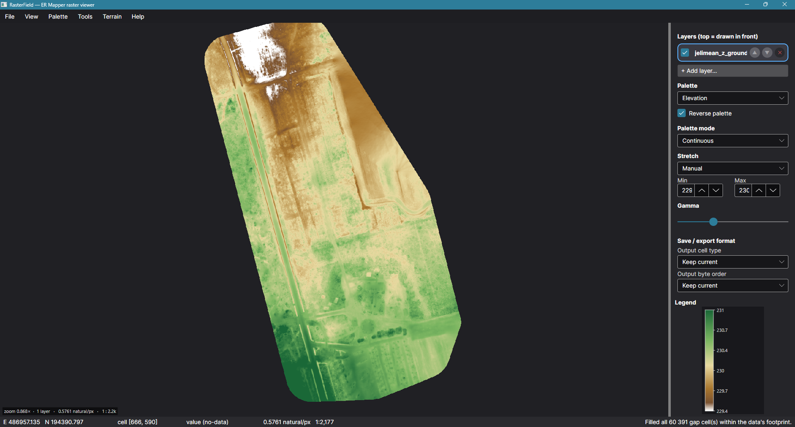

# RasterField

Robust, **complete reading and writing of the ERDAS ER Mapper file format**, plus GeoTIFF through GDAL —
both the **raster** dataset (`.ers` header + Band‑Interleaved‑by‑Line data file)
and the **vector** dataset (`.erv` header + ASCII object-list data file) — with
display in a modern, cross‑platform .NET application.



The application opens `.ers` + BIL datasets, keeps each layer's display state
separate, and lets you place raster and vector layers anywhere in the shared
draw order.

* **`RasterField.Core`** — a portable class library (`netstandard2.0` + `net10.0`,
  **no OS / `System.Drawing` dependency**): `.ers` parser & writer, BIL reader &
  writer, georeferencing, statistics, palette colourisation into a plain BGRA buffer.
* **`RasterField.Gdal`** — the isolated GDAL adapter for windowed GeoTIFF read/write on
  Windows, Linux and Intel/Apple-Silicon macOS; Core stays native-dependency-free.
* **`RasterField`** — an **Avalonia** desktop app (Windows / Linux / macOS) that
  opens, displays with palettes + pan/zoom, and **saves** `.ers` + BIL or GeoTIFF datasets
  (including format conversion), plus PNG export.

Format support follows the *ERDAS ER Mapper Customization Guide*
(`Documents/…`, chapters *File Syntax*, *Raster Datasets and Header Files (.ers)*
and *Vector Datasets and Header Files (.erv)*).

```
Source/
  RasterField.Core/     class library   (netstandard2.0 ; net10.0)   assembly RasterField.Core, namespace RasterField.*
  RasterField.Gdal/     GDAL adapter     (net10.0)                    GeoTIFF and windowed I/O
  RasterField/          Avalonia app     (net10.0, win/linux/osx)
  RasterField.Tests/    xUnit suite      (234 tests)
RasterField.slnx        solution
P_00_01.ers / P_00_01.dat   sample dataset (640×450 IEEE4, EOV)
```

## Library

### ER Mapper text format — `RasterField.ErMapper`

| Type | Purpose |
|---|---|
| `ErsTextParser` | Tolerant recursive parser for `Name Begin … End` blocks: `#` comments (not inside quotes), `\"` escapes, case‑insensitive keys, multi‑line `{ … }` arrays, `D:M:S` angles, GMT dates → `ErsBlock` tree. |
| `ErsHeader` | Strongly‑typed `DatasetHeader`, shared by raster and vector headers: version, name, `DataFile`, `SourceDataset`, `Comments`, `Description`, dataset/data type, `ByteOrder`, `HeaderOffset`, dates, `CoordinateSpace`, and either `RasterInfo` (`CellType`, `NullCellValue`, `CellInfo`, sizes, `NrOfBands`, `RegistrationCoord`, `RegistrationCell`, `BandId`, plus typed `SensorInfo`/`FiducialInfo`, `WarpControl`/`Correction`/`GivenOrthoInfo`, and read views of `RegionInfo`/`FFTInfo`) or `VectorInfo` (`Type`, `FileFormat`, `Extents`) for a `.erv` header. Everything else stays reachable via `RawBlock`. |
| `ErsHeader.ToErsText()` / `Save()` | **Loss‑less write:** modelled fields plus every unmodelled block/entry (e.g. `WarpControl.ControlPoints`, `RegionInfo.Stats`, vendor extensions) re‑emitted from `RawBlock`. Not preserved: `#` comments and original entry order. |
| `CoordinateSpace` | `Datum` / `Projection` name strings (verbatim), `CoordinateType` (RAW/EN/LL) **+ `CoordinateTypeRaw`** so an unknown keyword round‑trips, `CoordinateSystem` read alias, `Units` + `EffectiveUnits` (spec default: METERS for RAW, else `natural`), `Rotation`, and best‑effort `EpsgCode` / `TryGetEpsg()`. |
| `ProjectionRegistry` | Best‑effort `Projection`/`Datum` name → EPSG (`EPSG:nnnn` / bare numeric, UTM `NUTM`/`SUTM`/`UTMnnN`, Australian `TMAMG`/`MGA` zones, Web Mercator, geographic lat/long, Hungarian **EOV → 23700**). Convenience only — no coordinate transformation. |

Robustness: LF/CRLF, UTF‑8 BOM, missing optional blocks, `NrOfBands` absent → 1,
`DataFile` with a trailing dot, `HeaderOffset` skip, MSBFirst assumed when unspecified.
`Save()` stamps `Name` + `LastUpdated` like ER Mapper (opt‑out via `ErsSaveOptions`).

### Raster data — `RasterField.Rasters`

| Type | Purpose |
|---|---|
| `BilRasterReader` | Decodes the BIL file: every cell type, `ByteOrder` (LSB/MSB, swapped as needed), `HeaderOffset`, band de‑interleaving, `NullCellValue` → no‑data. Clear errors on truncation / unknown cell type. |
| `BilRasterWriter` | **Inverse** of the reader: writes bands in BIL order, rounds & clamps for integer cell types, substitutes the null value for no‑data. |
| `Raster` | Flat `float[]` band, no‑data aware; `RasterStatistics` (min/max/mean/σ, one pass), `RasterHistogram` (percentile stretches). |
| `IRasterSource` / `GdalRasterSource` | Format-independent window/overview access, with a GDAL-backed implementation for GeoTIFF. |
| `RasterChangeAnalysis` | Aligned-grid `second − first` ΔZ, statistics, absolute-threshold area and cut/fill/net volumes; optionally restricted to a world-coordinate polygon. `ComputeSummary(IRasterSource, …)` processes matching bounded tiles without creating a full difference band, while `MemoryRasterSource` lets the same path compare a loaded layer with a streamed one. |
| `RasterGeoReference` | Affine image ⇄ world mapping from `RegistrationCoord` / `RegistrationCell` / `CellInfo` / `Rotation`: `PixelToWorld`, `WorldToPixel`, `WorldToCell`, `WorldBounds`. |
| `NoDataFiller` | Patches no-data gaps, non-destructively, **restricted to the convex hull of the raster's valid data** — a genuine internal gap (sensor dropout, cloud mask, stripe, …) gets filled, but the no-data margin *outside* the data's actual footprint (a rotated scene's background corners, a mosaic's missing corner, …) is always left untouched. `FillNearest` — classic two-pass nearest-valid-cell propagation (Rosenfeld & Pfaltz, 1966; same operation as Esri's *Nibble* / GRASS's `r.grow.distance`), no distance limit. `FillInverseDistanceWeighted` — GDAL's `GDALFillNodata` algorithm: directional ray search + inverse-distance-weighted average + optional smoothing, finished off with a nearest-neighbour backstop so every in-hull gap ends up filled regardless of the chosen search distance. `CountNoDataWithinHull` reports just the real gaps, separate from `CountNoData`'s raw (hull-inclusive-and-exclusive) total. The hull itself (`ConvexHull.Compute`) is a standard, reusable Andrew's-monotone-chain implementation. |
| `RasterClipper` / `ErsDocument.Clip(...)` / `.ClipToWorldExtent(...)` | Crops a raster (and, at the document level, re-anchors the georeference so the crop's origin lands exactly where it did in the source — correct even under rotation) to a pixel window or a world-coordinate extent. Works whether or not the raster is loaded: with no bands loaded it reads straight from disk (see `RasterSource` below), so it doubles as the extraction tool for a large dataset. |
| `RasterSource` | Random-access reader over the data file: `ReadWindow(x, y, w, h, stepX, stepY)` reads only an arbitrary sub-window, optionally decimated; `ReadOverview(maxW, maxH)` reads a whole-image preview decimated to fit. Seeking past skipped rows is O(1), so both stay fast regardless of the file's true size — the basis of the large-dataset support below. |
| `RasterProfiler` | Samples a raster along an arbitrary line — `Sample`/`SampleWorld` return evenly-spaced `ProfileSample`s (distance, location, value) via `BilinearSample`, which follows the same corner-addressed convention as `RasterGeoReference` (a cell's value sits at its centre) and excludes no-data corners from the weighted average rather than poisoning the whole sample. `SamplePolylineWorld(IRasterSource, …)` profiles huge streamed rasters through a bounded 256×256 tile cache instead of loading the band. The basis of the app's Profile tool. |
| `TerrainAnalysis` | `Slope`, `Aspect`, `Hillshade` from an elevation raster, using Horn's (1981) 3×3 gradient method and the standard Lambertian reflectance model — the same defaults as `gdaldem`/Esri's Slope, Aspect and Hillshade tools. `Curvature` (Zevenbergen & Thorne, 1987): `General` (convex/concave overall shape), `Profile` (along the slope — governs flow acceleration) and `Plan` (across the slope — governs flow convergence); the direction-dependent Profile/Plan fall back, on a perfectly flat gradient, to the exact directional average `-(D+E)` (half of General). A 3×3 window touching no-data propagates no-data to that output cell; edges replicate their nearest interior neighbour. |
| `HydrologyAnalysis` | `FlowDirection` — classic single-flow-direction "D8" model, Esri's power-of-two encoding (0 = sink). `FlowAccumulation` — the upstream contributing-cell count for every cell, computed in one topological (Kahn's-algorithm) pass over the flow-direction DAG (guaranteed acyclic, since D8 only ever flows to a strictly lower cell). |
| `ViewshedAnalysis` | Line-of-sight visibility from an observer point ("R2" viewshed — straight-line-of-sight against the terrain profile, no earth-curvature correction): 1/0/no-data per cell, with observer/target height offsets and an optional distance cap. |
| `ReliefShader` (`RasterField.Rendering`) | Shading beyond palette colourisation: `MultidirectionalHillshade` averages several `TerrainAnalysis.Hillshade` azimuths (avoiding one light's harsh cast shadows — in the spirit of Mark, 1992); `RenderSwissStyle` adds an aerial-perspective tint (paler/cooler at higher elevation) for an Imhof/Swisstopo-esque analytical relief image, rendered directly as a `RasterImage`, not through a value-mapped palette. `RasterImage.ToRgbBands()` splits any rendered colour image (a relief, a PNG-style composite, …) back into three single-band rasters, so it can be saved as a genuine 3-band true-colour `.ers` dataset instead of only a flat image file. |
| `RgbCompositeRenderer` (`RasterField.Rendering`) | The inverse direction: renders three bands directly as an RGB `RasterImage` — no palette. Auto-stretches each band independently (its own 2nd–98th percentile, falling back to plain min/max then a unit range) unless told the data is already display-ready 0-255. A cell only renders transparent when *every* band is no-data there, so a pixel that's merely pure black in one channel isn't mistaken for missing data. |
| `RasterAlgebra` | A small band-math expression language — `Evaluate("(b1 - b2) / (b1 + b2)", bands)` for an NDVI-style index. Arithmetic, comparisons (`== != < <= > >=`), `abs sqrt exp log log10 min max pow iif(cond,a,b)`, constants `pi`/`e`. A cell is no-data in the output whenever any band *referenced by the expression* is no-data there — an unused band's gaps never leak into the result. |
| `RasterMosaic` / `ErsDocument.Mosaic(...)` | Merges several rasters (each with its own georeference — differing rotation/registration all honoured) over their combined world extent, at a chosen output cell size. `MosaicOverlapMode`: `FirstWins`, `LastWins`, or `Average` where sources overlap. |
| `ContourGenerator` | Traces lines of constant value through a raster (marching squares), with the standard centre-average disambiguation at saddle cells; `TraceLevels` does many levels in one pass. Returns world-coordinate polylines (vertices on the cell-centre grid, where the values actually sit) — a natural fit for `.erv` export. `Trace(raster, geo, ContourOptions)` adds index (major) contours every *n*-th level (`ContourLine.IsIndex`), Chaikin corner-cutting smoothing that keeps open lines' endpoints and closed rings closed, and a minimum-length filter; `BuildLevels` lists the whole multiples of an interval in a range. |
| `BezierPatchInterpolator` / `ErsDocument.Subdivide(...)` | Bicubic **Bézier-patch** interpolation of a gridded surface and **subdivision** to a *k*× finer cell size. Each patch spans four neighbouring cell centres; its 16 control points come from the node values and central-difference (Catmull-Rom) derivatives via the Hermite → Bézier conversion, so the surface is C¹-continuous across patches and reproduces a plane exactly. `Tension` blends from Catmull-Rom (1) to exact bilinear (0); `Monotone` limits tangents (Fritsch–Carlson style) and clamps to the patch's corner range so sharp steps don't overshoot; `NoData` chooses a bilinear fallback or strict no-data next to gaps. The image border is extended by point reflection. `ErsDocument.Subdivide` works on every band (loaded or streamed), for the whole dataset or a cell window, keeping extent/origin/rotation and dividing the cell size by *k*. |
| `ZonalStatistics` / `Measurement` | Statistics of the cells whose centre lies inside a polygon (scanline, works under rotation); the `IRasterSource` overload groups intersecting scanline spans into bounded tiles so huge streamed rasters are analysed without loading the full band. Polyline length, polygon perimeter/area, and terrain-following surface length. `RasterProfiler.SamplePolylineWorld` samples a multi-vertex path with a pluggable interpolator (bilinear or Bézier). |
| `StreamNetwork` | Vector stream network from D8 flow direction + accumulation: cells at or above a threshold are chained downstream into segments that break at confluences, each with its **Strahler order** and outlet accumulation. |

### Large datasets — streaming instead of loading everything

`ErsDocument.IsLargeDataset` (a configurable cell-count threshold, default ~16
million — roughly 4000&#215;4000) flags a raster too big to comfortably hold as
a single `float[]`. For one, skip `LoadRaster()` and use `ErsDocument.OpenSource()` /
`RasterSource` instead — read only the window you need, at whatever resolution
you need it, without ever materialising the full raster. This is what the
viewer does automatically (see below); the library exposes it directly for
scripted extraction/conversion of huge scenes.

```csharp
var doc = ErsDocument.LoadHeaderOnly("huge_scene.ers");   // instant — parses only the header
if (doc.IsLargeDataset)
{
    using var source = doc.OpenSource();
    var overview = source.ReadOverview(1024, 1024);        // whole-image preview, bounded size
    var window = source.ReadWindow(4000, 3000, 800, 600);  // exact pixels you actually need
}
var region = doc.Clip(4000, 3000, 800, 600);               // same idea, wrapped as a new dataset
region.Save("region.ers");                                 // small enough to write normally
```

### Vector data (`.erv`) — `RasterField.Vectors` (objects) + `ErvDocument` (facade)

Full read/write support for the ER Mapper vector object-list format: `point`,
`box`, `oval`, `text`, `vtext`, `poly` (polyline), `polygon`, `map_box` and
`map_polygon`, each as a typed class (`VectorPoint`, `VectorPolygon`, …). The
parser is not line-based — it tracks quote/bracket state across the whole file,
since the format allows a polyline/polygon/text object to legitimately span
several physical lines and an attribute string to embed commas or newlines.
The writer never emits exponent notation (the format forbids it). `ErvDocument`
mirrors `ErsDocument`: `Load`/`Save`, and `ComputeExtents()` to auto-fill the
header's `VectorInfo.Extents` from the objects' own coordinates.

```csharp
var erv = ErvDocument.Load("roads.erv");
foreach (var obj in erv.Objects)
    if (obj is VectorPolyline road) Console.WriteLine(road.Points.Count);

var made = ErvDocument.Create(projection: "BMG:EOV", datum: "EPSG:6237");
made.Objects.Add(new VectorPoint { Attribute = "peak", X = 650000, Y = 240000, R = 255 });
made.Save("peaks.erv"); // Extents computed automatically
```

### GeoJSON, CSV and projects

`GeoJsonFormat` reads and writes FeatureCollections (points, lines, polygons — inner rings become
separate polygons, since the ER Mapper format has no holes; boxes/ovals are written as polygons).
`CsvPointFormat` reads point lists with separator, header, column-name and decimal-comma
detection. `RasterField.Projects.ProjectDocument` is the `.rfproj` model the app saves: layers
with display settings and recipes, the view and bookmarks, with paths stored relative to the
project file. None of them reproject coordinates.

### Colourisation — `RasterField.Rendering`

`Palette` (256‑entry LUT: gradient stops, colours, RGB rows, or a decoded image
strip via `Palette.FromImage`), `PaletteFile` (DigiTerra `.pal` read/write),
`BuiltInPalettes` (Grayscale, Spectrum, Viridis, Elevation, Land & Sea,
Blue‑White‑Red, Temperature, Precipitation, Green‑Brown), `RasterColorizer`
(linear stretch, gamma, invert, opacity, no‑data colour; continuous / discrete /
nearest; `MinMax` / `Sigma` / `Percentile` factories), `RasterImageRenderer` →
`RasterImage` (`BGRA8888` buffer — copy straight into an Avalonia/WPF/Skia
writeable bitmap).

```csharp
// read
var doc = ErsDocument.Load("P_00_01.ers");
float? v = doc.Sample(easting, northing);
var img = RasterImageRenderer.Render(doc.Band, RasterColorizer.Percentile(doc.Band, BuiltInPalettes.Elevation));

// write (with format conversion)
doc.Save("out.ers", new ErsSaveOptions { CellType = ErsCellType.Signed16BitInteger, ByteOrder = ErsByteOrder.MsbFirst });

// build a dataset from scratch
var made = ErsDocument.Create(band, originX: 640000, originY: 240000, cellSizeX: 50, cellSizeY: 50, projection: "BMG:EOV");
made.Save("new.ers");
```

## RasterField app (Avalonia, cross‑platform)

* **Layers** — load any number of datasets at once and stack them: *File ▸ Add
  layer(s)…* (or `Ctrl+Shift+O`, or just drag another `.ers` in once one is already
  open) adds a source on top of what's loaded, without replacing it; *File ▸ Open*
  still replaces everything, for the classic single-dataset flow. The **Layers**
  panel lists them top-to-bottom in stacking order (top of the list = drawn in
  front) as rounded cards — the active layer's card gets an accent border and
  tint, so it's obvious at a glance which one every tool and side-panel control
  targets — each with a visibility checkbox, click-to-activate, and circular
  ▲/▼/✕ buttons (a properly-sized, clearly clickable target, not a cramped
  default-sized square one) to reorder or remove. Layers with different
  origins, cell sizes, projections or even rotation all line up correctly on
  screen — each is projected into the active layer's view through its own
  georeference. Multiple files on the command line (`RasterField a.ers b.ers
  c.ers`) load the same way, first as the base, the rest as layers on top.
* **Vector layers** — a `.erv` file can be added as a layer too (same *Add
  layer(s)…* dialog, or drag-and-drop). It appears in the same shared layer
  stack as rasters (marked with a ▤), with its own visibility and ▲/▼/✕;
  the arrows can move it in front of or behind a raster layer. Points, polylines,
  polygons, boxes/ovals and text all render at their real-world position over
  whatever raster is loaded (page-relative map-composition objects are skipped —
  this is a data viewer, not a print-layout renderer). Needs at least one raster
  layer loaded first, to give the view a coordinate frame.
* **Mini-GIS layout** — three columns: *Layers* and *Analysis* (Identify / Profile / Measure &
  zone tabs) on the left, the map in the middle, the active layer's *Properties* (band, palette,
  stretch with an **interactive histogram** — drag its two handles —, gamma, opacity, **blend
  mode**, derivation, metadata, full ERS header) and the legend on the right. `F9` / `F10` / `F11`
  toggle the side panels / map only. **Command palette** (`Ctrl+K`) searches every menu command,
  accent-insensitively. Hungarian and English UI (*View ▸ Language*).
* **Derived layers with recipes** — every analysis result (Bézier subdivision, contours, stream
  network, slope/aspect/hillshade/curvature, flow direction/accumulation, band math, viewshed,
  clip, mosaic) becomes a **new layer in memory**, marked `↳` (derived) and `●` (not saved yet);
  its tooltip says what it was made from. Layers made by a recipe can be **recomputed with new
  parameters** in place (*Parameters…* in the properties panel, `↻` on the card, or the card's `⋮`
  menu). `⤓` saves a layer as `.ers` + data or `.erv`.
* **Blend modes & opacity** — Normal, Multiply (hillshade over a DEM), Screen, Overlay, Darken,
  Lighten, Soft light, plus an opacity slider per raster layer.
* **Projects** (*File ▸ New / Open / Save project*, `Ctrl+S`) — a `.rfproj` JSON file with the layer
  stack, display settings, blend modes, view and bookmarks, paths relative to the project;
  unsaved derived layers are stored as **recipes** and recomputed on open.
* **Undo / redo** (`Ctrl+Z` / `Ctrl+Y`) for layer add/remove/reorder/visibility, display and style
  changes and recomputes; slider drags coalesce into one step. Closing, *New project* and *Open
  project* warn about layers that exist only in memory.
* **Bookmarks & navigation** — `Ctrl+Shift+D` adds a bookmark, `Ctrl+1…9` jumps to one;
  *View ▸ Go to coordinate…*.
* **Vector formats** — `.erv`, **GeoJSON** and **CSV points** (separator, header and decimal-comma
  detection) can be added as layers (dialog, drag-and-drop, command line) and exported from a
  vector card's `⋮` menu. Vector layers can be the **first layer**: an invisible frame provides the
  coordinate system until a raster arrives.
* **Path tools** — **Profile** (`P`): a multi-point path with a live chart in the Analysis panel
  (every visible raster layer, including huge streamed datasets, plus the Bézier-interpolated curve
  for loaded/clipped layers), a larger window and CSV export. Streamed profile reads run in the
  background, are cancelled when superseded and keep only a small bounded tile cache in memory.
  Hovering either profile chart shows a distance/value crosshair and highlights the same sampled
  world-coordinate position on the map;
  or along a vector line (card menu). **Measure** (`M`): length, terrain-following surface length,
  perimeter and area. **Zone** (`Z`): zonal statistics of every visible raster inside a drawn
  polygon; *Analysis ▸ Zonal statistics by polygon layer…* does it per polygon of a vector layer,
  with CSV export. Both zonal modes work directly on huge streamed rasters in the background;
  redrawing the interactive zone cancels its superseded calculation. Click adds a point, drag
  moves it, dragging the small handle at a segment's
  midpoint inserts a new point there (also on a polygon's closing edge), double-click / Enter
  finishes, Backspace removes the last point.
* **Bézier-patch subdivision** (*Raster ▸ Bézier-patch subdivision…*, `Ctrl+B`) —
  ×2/×3/×4/×8 or custom, whole layer or current view, tension, monotone (no overshoot) and
  no-data behaviour; resulting size and memory estimate and a side-by-side preview (original vs.
  Bézier). The result keeps the source layer's palette and stretch.
* **Bézier display smoothing** (*View ▸ Magnification ▸ Bézier patch*, or `B`) — magnified cells of
  the active layer drawn as a smooth Bézier surface computed for the visible window only.
* **Contours as a layer** (*Analysis ▸ Generate contours…*) — index contours drawn thicker and
  **labelled along the line**; source surface (original grid or a Bézier ×2/×4 surface),
  Chaikin smoothing and a minimum line length under *Advanced*.
* **Stream network** (*Analysis ▸ Hydrology ▸ Stream network…*) — line widths grow with Strahler order.
* **Identify** (`I`) — click the map: every visible layer's value (all bands, bilinear and
  Bézier-interpolated), and the nearest vector object, in the Analysis panel.
* **Statistics & histogram** (*Analysis ▸ Statistics & histogram…*).
* **Per-layer display settings** — select a raster layer in the Layers panel,
  then use the right-side panel to change that selected file's palette, stretch,
  gamma, band and RGB-composite settings. Every raster retains its own settings
  when another layer is selected. Vector cards carry their own colour and
  line-width controls.
* **Everything is per-layer** — palette, reverse, mode, stretch, gamma, which
  band is shown, and the RGB-composite toggle are all independent per layer;
  switching the active layer (click it in the panel) swaps the whole side panel
  to *that* layer's own settings, and re-bases pan/zoom so the same real-world
  area stays on screen. The pointer-value readout in the status bar, and every
  interactive tool (clip selection, profile line), always target the **active**
  layer specifically — exactly the one highlighted in the Layers panel.
* **Open** `.ers`, `.tif` and `.tiff` — menu, drag‑and‑drop, or command line; *File ▸ Open recent* keeps
  the last 10 datasets (persisted across restarts).
* **Remembers your setup** — window size/position/maximized state, last-used
  palette + reverse flag + stretch mode, theme choice, and the last folder you
  opened from, all saved to a small per‑user settings file
  (`%AppData%/RasterField/settings.json` on Windows; the XDG/Library equivalents
  elsewhere) and restored on next launch.
* **Theming** — follows the OS light/dark setting live by default; *View ▸
  Theme* offers System/Light/Dark explicitly. A single curated palette
  (`AppTheme`, in `RasterField/AppTheme.cs`) drives every custom-drawn piece of
  chrome — window/panel/status-bar backgrounds, the raster canvas backdrop, the
  active-layer highlight — so light mode is a real, considered second theme, not
  a hardcoded dark palette left to look broken under a light system setting.
* **Platform-native touches** — a Windows 11 Mica / macOS vibrancy window
  backdrop where the OS offers one (`Window.TransparencyLevelHint`, falling back
  cleanly where it doesn't). On macOS specifically, the app's menu lives in the
  real system menu bar (via Avalonia's `NativeMenu`, mirroring the in-window one
  used on Windows/Linux) rather than an in-window strip, with a proper
  *RasterField* application menu (About, Hide, Quit) and a Window menu. The
  client area extends under the title bar, where a unified 44 px bar
  (`MainWindow.TitleBar.cs`) holds the traffic lights, a sidebar toggle, the
  project title with the active layer, a ⌘K command-search pill and an
  inspector toggle; drag it to move the window, double-click to zoom.
* **Menus** — `File · Edit · View · Layer · Raster · Analysis · Tools · Help`:
  *Raster* holds processing that produces modified data (band math, gap fill,
  Bézier subdivision, clip, mosaic); *Analysis* holds measurements and
  derivations (statistics, zonal, ΔZ, *Terrain ▸*, *Hydrology ▸*, contours);
  comparison, magnification and theme live under *View*, palettes under *Layer*,
  exports under *File ▸ Export*.
  On macOS they live in the system menu bar; on Windows and Linux the same menus
  form the horizontal in-window menu bar, above the app bar (sidebar toggles,
  title and `Ctrl+K` command search).
* **Multi‑band datasets** — a **Band** selector appears in the side panel whenever
  the dataset has more than one band; switching re‑stretches and re‑colourises
  for the newly selected band (works in streaming mode too).
* **Responsive on heavy operations** — fill no‑data, clip, terrain, band math,
  mosaic and contour generation all run off the UI thread with a busy overlay,
  so the window never appears to freeze on a large computation.
* **Display** — pan (drag), zoom to cursor (wheel), `Ctrl +/-`, `0`/`F` to fit;
  nearest‑neighbour by default (crisp cells), optional smoothing and cell grid.
* **Large datasets, transparently** — a dataset over `ErsDocument.IsLargeDataset`'s
  threshold (~4000&#215;4000 cells by default) is never loaded into memory: the
  view opens a `RasterSource` and re-reads only the visible window (decimated
  to match the zoom level) on a background worker after a short debounce. Rapid pan/zoom
  gestures cancel superseded requests, only the newest result may update the view, and source
  access/disposal is serialised to avoid races. Memory use stays a small,
  roughly constant amount regardless of the source file's size — a 192 MB scene
  in testing added only ~15–20 MB to the process, versus the whole file (plus
  an equally large colourised bitmap) before this. The status bar and on‑canvas
  hint show *(streaming)* in this mode; the Clip tool still works (and is the
  recommended way to pull a smaller, fully‑editable region out of a huge scene). Multi-point
  profiles, zonal statistics and ΔZ/volume summaries also read only bounded source tiles, so they
  work directly on these large layers without a preliminary clip.
* **Palettes** — built‑ins + every `.pal` and PNG/BMP strip in `palette/`; reverse
  toggle; continuous / discrete / nearest modes; live legend. The bundled files are
  named in English by their content, low → high (e.g. *Precipitation (brown-blue)*,
  *Hue wheel (cyclic)*), and every palette name is shown translated in the Hungarian
  UI. Former names (the old Hungarian file names, `Land &amp; Sea`) resolve through
  `PaletteLibrary.AddAlias`, so older settings and projects keep their palette.
* **Palette editor** (*Layer ▸ Palette ▸ Edit current palette… / New palette…*) — drag
  gradient stops on a colour bar, add one by clicking it, fine-tune the selected
  stop's position and colour (R/G/B or hex), reverse, preview live in the viewer,
  then *Save to palette list* (also written to a per‑user palette folder so it
  survives restarts) or *Save as .pal file…* anywhere.
* **Stretch** — full min/max, mean ± 2σ, 2–98 %, or manual min/max; gamma slider.
* **Scale** — the status bar and the on‑canvas hint show the live ground sample
  distance (world units per screen pixel, from the georeference — correct for
  rotated images too) and an approximate map scale (`1 : N`, from the display's
  actual DPI where available).
* **Fill no-data gaps** (*Raster ▸ Fill no-data gaps…*) — patches gaps with either
  a fast nearest‑valid‑cell fill or GDAL‑style inverse‑distance‑weighted
  directional search with optional smoothing (see `RasterField.Rasters.NoDataFiller`
  above); only counts and fills gaps *inside* the data's convex hull, and every
  one of those is guaranteed filled — the outside-footprint background is
  reported and touched never.
* **Clip / cutout tool** (*Tools ▸ Clip tool*, `C`) — a fully visual, adjustable
  selector: drag out a rectangle, then keep dragging its **body to move it** or
  any of its **8 corner/edge handles to resize it**; a live label on the
  rectangle shows its size in both pixels and world units, and a floating bar
  over the view shows the same plus **Crop → new layer** / **Cancel** (or
  `Escape` to clear it). *Raster ▸ Clip by extent (E/N)…* offers the same result
  from typed numeric bounds instead of dragging. Either way it writes a
  brand-new, correctly re‑anchored dataset as a derived layer (save it with its card's `⤓`).
* **Analysis ▸ Terrain / Hydrology** — **Slope**, **Aspect**, **Hillshade**, **Curvature** (General/Profile/Plan)
  from the loaded band, each added as a new derived layer (in memory until saved); **Flow
  direction** and **Flow accumulation** (D8 hydrology); **Viewshed** (pick an observer cell,
  eye/target height and an optional distance cap in a dialog); and **Swiss-style relief** — a
  multi-directional-hillshade-plus-aerial-perspective colour image, added (like the others) as a
  derived 3-band true-colour layer with a recipe (`RasterImage.ToRgbBands()`), saved with the
  layer card's ⤓. Each product gets a display that fits what it measures, not the selected
  elevation palette: hillshade grey 0–255, slope Viridis from 0° to the 99th percentile, aspect
  the cyclic hue wheel over 0–360°, curvature blue-white-red symmetric around 0, flow
  accumulation a blue ramp with low gamma; the unit (°, 0–255, cells) shows on the legend. If
  the active layer is itself a terrain product (e.g. the hillshade just made), the tools run on
  the elevation layer it was derived from instead of on its brightness values.
* **True-colour RGB composite** — a dataset with 3+ bands (e.g. that Swiss-style relief export,
  or any RGB imagery) shows a **True colour (RGB composite)** checkbox next to the Band
  selector, on by default for exactly-3-band data. It renders bands 1–3 directly as colour
  (`RasterField.Rendering.RgbCompositeRenderer`) — no palette — auto-stretching each band's own
  2–98th percentile range, or using raw 0–255 values as-is for an already 8-bit dataset; a cell
  that is no-data in *every* band renders transparent (not just one, so a pixel that's merely
  pure black in a single channel isn't mistaken for missing data). Works in streaming mode too.
  Switch it off to fall back to single-band + palette viewing via the Band selector; the
  palette/stretch/gamma controls are disabled while the composite is showing, since they don't
  apply to it.
* **Band math** (*Raster ▸ Band math…*) — type an expression over the current
  dataset's bands (`b1`, `b2`, …) — e.g. an NDVI-style `(b1 - b2) / (b1 + b2)` —
  and get the result as a new derived layer.
* **Mosaic rasters** (*Raster ▸ Mosaic rasters…*) — pick two or more `.ers` files,
  an output cell size and an overlap rule (first/last/average); the merged result
  becomes a new derived layer.
* **Change analysis** (*Analysis ▸ Compare / ΔZ & volume…*) — validates exact grid/CRS
  compatibility, creates a blue-white-red `second − first` layer, and reports min/max/mean/σ,
  threshold-exceedance area and cut/fill/net volumes for the full raster or the finished map zone.
  If either input is a huge streamed layer, statistics and volumes are computed tile by tile with
  bounded memory; in that mode no multi-gigabyte in-memory ΔZ layer is created.
* **Swipe / Blink comparison** (*View ▸ Comparison*) — isolates any two raster layers for visual
  inspection. Swipe places them on opposite sides of a draggable vertical divider; Blink alternates
  them at a configurable interval. Vector overlays remain visible in both modes, and `Esc` restores
  the normal layer stack.
* **Write** — *Save header as .ers*, *Save dataset as…* (`.ers` + BIL or GeoTIFF, with an
  optional output **cell type** and **byte order** for on‑the‑fly conversion),
  *File ▸ Export ▸ View as PNG*, and *Inspection report as PDF*. The A4 report embeds the current
  map view, palette and numeric range, source/CRS/raster metadata, statistics, derivation details
  (including ΔZ threshold and cut/fill volumes), plus a second profile-chart page when a profile
  has been drawn. It uses the app's bundled Inter font and PDFsharp Core, so output is portable
  across Windows, Linux and macOS.
* **Status bar** — world easting/northing, cell index, sampled value and scale
  under the pointer; dataset summary (size, cell type, projection + resolved EPSG,
  byte order, data range).

## UI / UX plan

The mini-GIS interface design — layer model, derived raster and vector layers
(contours, stream networks), analysis tools and Bézier-patch subdivision — is
described in [`docs/UI-UX-TERV.md`](docs/UI-UX-TERV.md) (Hungarian), including a
section on what is implemented so far and what is still open.

## App icon & packaging

The icon (terrain bands whose lower half is raster cells and upper half smooth Bézier contours)
is generated by `Packaging/icon/build_icons.py` into `Source/RasterField/Assets/`: `.icns` for
macOS, `.ico` for Windows (embedded in `RasterField.exe`), PNGs for the window icon. The design
and the macOS / Windows conventions it follows are described in
[`Packaging/icon/README.md`](Packaging/icon/README.md). `Packaging/macOS/make-app.sh` builds a
`RasterField.app` bundle from an `osx-*` publish; the release workflow uses it.

## Build · test · run

```bash
dotnet build RasterField.slnx
dotnet test  RasterField.slnx
dotnet run --project Source/RasterField/RasterField.csproj -- P_00_01.ers
```

Needs the .NET 10 SDK. To ship a standalone build for another OS:

```bash
dotnet publish Source/RasterField/RasterField.csproj -c Release -r linux-x64  --self-contained
dotnet publish Source/RasterField/RasterField.csproj -c Release -r osx-arm64  --self-contained
```

## Performance

Two hot paths carried far more per-pixel/per-sample overhead than they needed to; both are now
measured, not just assumed, faster:

* **Colourised rendering** (`RasterImageRenderer.RenderInto`) used to call the full
  `RasterColorizer.Map` — palette sampling, gamma's `Math.Pow`, the render-mode switch — for
  *every pixel*, on every pan, zoom, palette change and band switch. It now bakes a 4096-entry
  ARGB lookup table once per render (`RasterColorizer.BuildArgbLut`, which already existed but
  wasn't wired up) and reduces each pixel to one array index, plus splits rows across threads for
  a large image. 4096 steps is far finer than any display can show a difference at, so this is
  not a quality trade-off. **Measured: a 4000×4000 raster with gamma correction went from 837 ms
  to 87 ms — 9.6×.**
* **BIL float32 decoding** (`BilRasterReader`, `RasterSource.ReadWindow` — the streaming pan/zoom
  path) used to call a per-sample decode function for every cell. `IEEE4ByteReal` — the dominant
  real-world cell type here — is now bulk-copied a whole row at a time
  (`BilCodec.DecodeFloat32Row`, `Buffer.BlockCopy`, with an in-place 4-byte-word swap first when
  the file's byte order doesn't match the host's), since a float32 sample is already bit-for-bit
  the destination's own representation once byte order matches — there's nothing left to "decode"
  one cell at a time. **Measured: a 2000×2000 streamed window read went from 34 ms to 14 ms — 2.4×**;
  a full 4000×4000 (16M-cell) load takes ~45 ms.
* **Streaming interaction** no longer performs disk/GDAL window reads on Avalonia's UI thread.
  A 40 ms debounce coalesces wheel/pan bursts, cancellation generations discard stale results,
  and a single read gate prevents overlapping source access. The last valid frame remains visible
  while the new window loads, with a small `streaming · loading…` status hint.

Every existing test (including the exact byte-order and no-data-mapping ones) still passes
unchanged — both optimizations produce bit-identical output to the code they replaced.

* **Vector layer rendering** used to allocate a fresh `SolidColorBrush`/`Pen` for *every object* on
  *every repaint* (even though a layer's colour/width is now shared by every object in it — see
  Per-layer style above), and walked and tessellated every object regardless of whether it was
  anywhere near the viewport. Both are fixed: the brush and pen are built once per layer per
  frame, and each object's world-space bounding box is precomputed once at load time
  (`VectorLayer.ObjectBounds`) so a repaint can reject an off-screen object — without touching its
  point list at all — before doing any per-vertex work. A `.erv` with thousands of features and
  only a fraction on screen at a time (the common case once you're zoomed in) now costs
  proportional to what's visible, not to the whole file.

## Quality gates & CI

* **`Directory.Build.props`** turns the project's "0 warnings" convention into a hard build
  failure everywhere (`TreatWarningsAsErrors`), so a regression is caught at build time, not by
  re-reading a log. `RasterField` and `RasterField.Tests` (both `net10.0`-only) additionally opt
  into `AnalysisLevel=latest-recommended` for the newer .NET analyzer rule set; `RasterField.Core`
  stays at the default level since it multi-targets `netstandard2.0`, where some of those rules'
  suggested fixes (e.g. `ArgumentNullException.ThrowIfNull`) aren't available. The test project
  turns off `CA1707` only — xUnit's own `Descriptive_snake_case_name` convention for test methods
  is a deliberate, widely-endorsed exception to that rule.
* **`.github/workflows/ci.yml`** — on every push/PR to `main`: restore, build (Release, warnings
  as errors), test with code-coverage collection (`coverlet.collector`) on Windows, Linux and
  macOS, plus a publish smoke-test for all four shipped RIDs (`win-x64`, `linux-x64`, `osx-x64`,
  `osx-arm64`) so a packaging regression is caught before a release attempt.
* **`.github/workflows/release.yml`** — on a `v*` tag: re-runs the tests, then publishes a
  self-contained, single-file build per RID and a `RasterField.Core` NuGet package, both attached
  to the GitHub Release.
* **Code coverage** — `dotnet test --collect:"XPlat Code Coverage"` on `RasterField.Core`
  currently measures **91.3% line / 72.2% branch** coverage (up from 89.5%/70.2% before this
  pass's added `PaletteLibrary` and `VectorMapPolygon` tests). The weakest spots are
  `RasterColorizer` (52%) and `Palette`/`BilCodec` (~67%) — worth a follow-up pass.

## Sample data

Only `P_00_01.ers` (the header) is original. `P_00_01.dat` is a synthetic
640×450 IEEE4 / LSBFirst surface generated so the app and the integration tests
run on real data; replace it with the true `.dat` any time.
